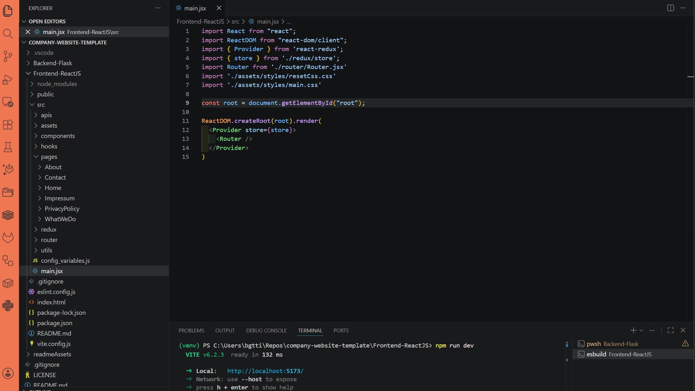
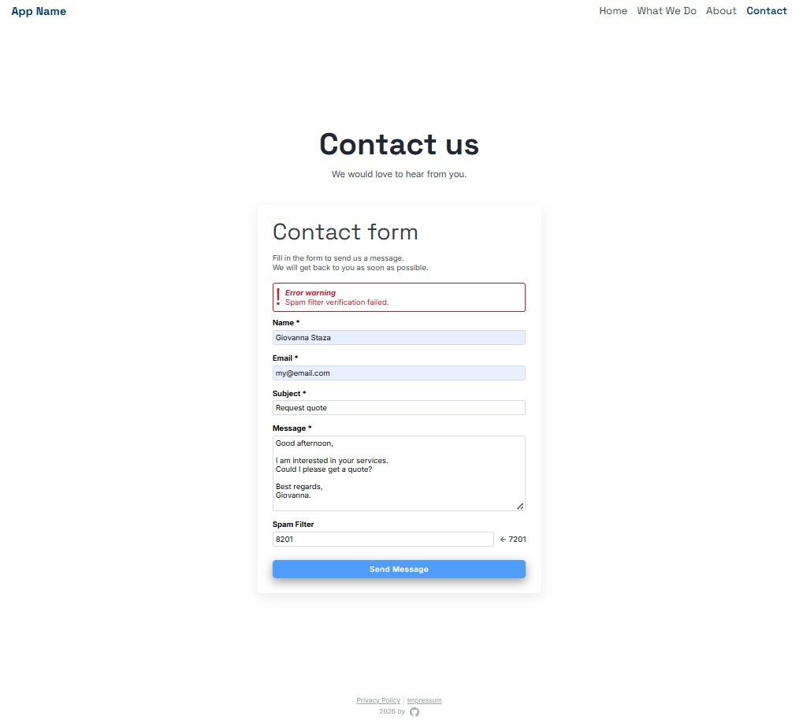
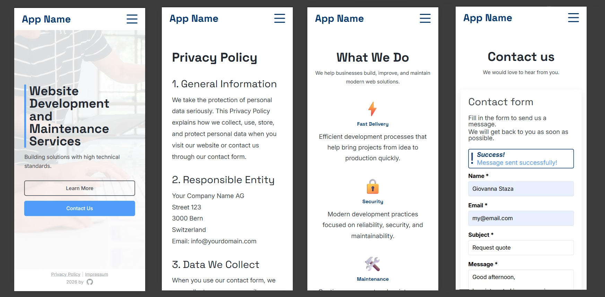

<div align="center">
  <br>
  <h1><b>Express + React App Registration Template</b></h1>
  <strong>React + Vite Front-end</strong>
</div>
<br>

<hr>


<hr>

# Table of Contents
- [Introduction](#introduction)
- [Installation](#installation)
- [Code and organization](#code-and-organization)
- [The App](#the-app)
- [About and license](#about-and-license)
<br>

# Introduction

This is the React frontend for a full-stack company website template app using React with Vite, React Router, and form handling with communication to an Python Flask backend. This README file refers specifically to the functioning of the Frontend portion of the application.

This project contains the UI and styling for the following pages:
- Homepage
- About page
- What We Do / Services / Portfolio page
- Contact page
- Privacy Policy page
- Impressum (Legal) page

This project is using the following extensions:
- React Router for routing
- Redux Toolkit for state management
- Axios for HTTP requests
- PropTypes to to validate props

# Installation

<details>
   <summary>1. Clone this repository</summary>

   >\
   > More information on how to clone this repository [available here](https://docs.github.com/en/repositories/creating-and-managing-repositories/cloning-a-repository)
   > then enter the frontend folder using:
   > ```pwsh
   >cd Frontend-ReactJS
   >```
   ><br/>
</details>

<details>
   <summary>2. Install dependencies</summary>

   >\
   > Make sure you have NodeJS installed. You can then proceed to install dependencies with the command:
   >\
   > ```pwsh
   >npm install
   >```
   ><br/>
</details>

<details>
   <summary>3. Run the app</summary>

   >\
   >Start the react app with the command:
   > ```pwsh
   >npm run dev
   >```
   ><br/>
</details>

<details>
   <summary>4. Enable the API handler</summary>

   >\
   >Navigate to `Frontend-ReactJS/src/api/handlers/contactSubmission.js` and delete the following code:
   > ```pwsh
   >//DELETE THIS PART BELLOW (BACKEND DE-ACTIVATION)
   >return Promise.resolve({
   >  response: true,
   >  message: "Message sent successfully."
   >});
   >//DELETE THIS PART ABOVE (SO EMAIL SENDING CAN WORK)
   >```
   ><br/>
</details>


# Code and organization

The main entry to the application is `main.jsx`, where the main css files are imported, and which will return the Router.



## router

This project uses the React Router library. It creates the App around it in `main.jsx`.
In the `router`directory, you will find the `Router.jsx` component, which imports all app pages and layout components (Header/Footer).

You can read more about the routing implementation used in this application from the documentation accessing the link: [click here](https://reactrouter.com/start/declarative/routing).


## apis

Requests to the backend are made using axios. `axios.js` is the axios configuration file.
`apiEndpoints.js`contain the backend's url to which requests should be made. All urls are in this file for ease of maintenance (in case more endpoint are necessary in the future).

`apiHandlers` is a folder containing a file for each endpoint through which requests are sent to the backend. Functions in these files are called by the components to make http requests.

## assets

The assets directory contains all images, icons, general css files (imported into `main.jsx`), font files (this application uses Inter and Space Grotesk google fonts).

## components

The `components` directory contains the layout components `Header`and `Footer`, imported into the `Route`component. They also have their own css file in their respective folders.
`Loader` is the loader component, also imported into `Routes.jsx` and it's display can be controlled using redux. The loader is activated from within page components before making an api request, and deactivated once the request is resolved.
`ErrorMessage` and `SuccessMessage` are parts imported and used in other page components to display messages.

## hooks

Contains custom hookes.
`useIsComponentMounted` checks whether a component is mounted, used to show state changes after an api request -- if the component in question is indeed still mounted. 

## pages

Contains all website pages, such as homepage, about, etc.
Each page has a folder containing it's jsx, and some main contain a specific css file (when the component requires specific styling).

## redux

Redux is used to manage state.
`store.js` is where the slices are imported into the redux store. There are currently only one slice: loader.
Loader is used for when the loader should be displayed. 

## utils

`authUtils.js` contains utility functions such as checking whether a email is valid.
`constants.js` contains an object with input length for name, email, etc which is used inside authUtils as well as in apiHandlers or forms to validate input length.
Note that a similar file to `constants.js` is also to be found in the Back-end folder for similar purposes (for Json Schema validation). Should you make changes to this file, you might want to correct the Backend file as well.

## config_variables

`config_variables.js` contains configuration data that should be adapted prior to using this project.
It sets important global variables such as the app backend URL, as well as company legal information.

# The App

The app contains the main pages required for a front-end application, and basic styling for each.
It is meant to be used as a template for building other applications.


## Error handling

Very basic server-side error handling was implemented in the forms.



## Mobile version

Simple styling was added, with the attempt to build the app mobile-fist.



## App versions

The React frontend was created in the App's version 1.

# About and license

This is a personal project completed by the author, which you are welcome to use and modify at your discretion.