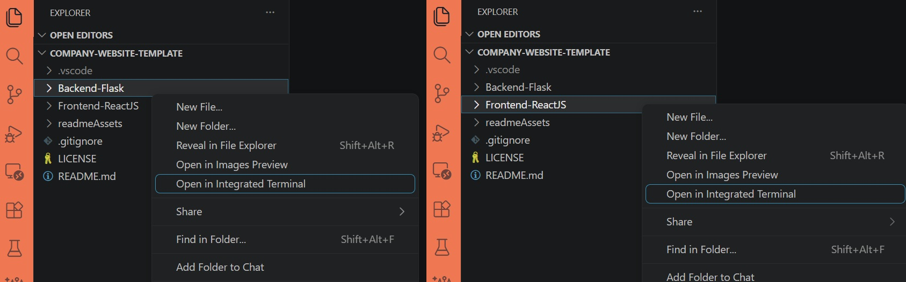
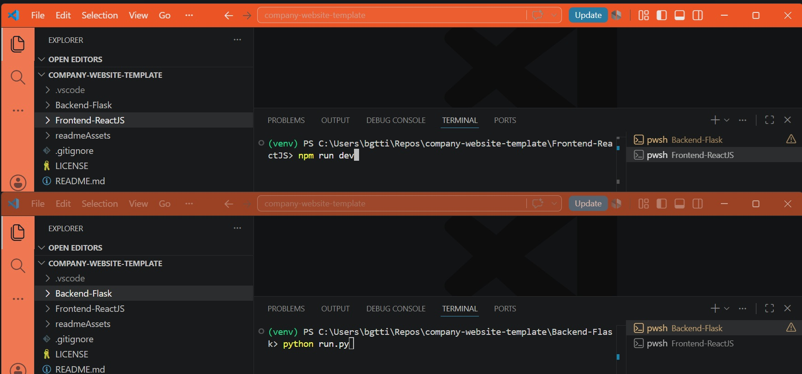

<div align="center">
  <br>
  <h1><b>Fullstack Company Website Template</b></h1>
  <strong>Template Website and Contact Form</strong>
</div>
<br>
<table align="center" style="border-collapse:separate;">
  <tr>
    <td style="background: #344955; border-radius:20px; border: 5px solid transparent"><small>React JS</small></td>
    <td style="background: #344955; border-radius:20px"><small>Python Flask</small></td>
  </tr>
</table>
<hr>


<hr>

# Table of Contents
- [Introduction](#introduction)
   - [Functionality](#functionality)
   - [Tech Stack and Tools](#tech-stack-and-tools)
- [Installation](#installation)
- [Project Structure and Documentation](#project-structure-and-documentation)
   - [Frontend-ReactJS](#frontend-reactjs)
   - [Backend-ExpressJS](#backend-expressjs)
   - [readmeAssets](#readmeassets)
- [The App](#the-app)
- [Versioning and branches](#versioning-and-branches)
- [About and license](#about-and-license)
<br>

# Introduction

A full-stack boilerplate project featuring homepage, contact form functionality and more. Built with **Flask** and **React.js**.

This monorepo contains separate frontend and backend apps, structured to help you kickstart a fullstack website.

The codebase is clean and modular, with a straightforward folder structure and clear documentation, making it easy to build upon and extend with your own features.

## Fuctionality

This project contains the base functionality and styling for:
- Homepage
- About page
- What We Do / Services / Portfolio page
- Privacy Policy page
- Impressum / Legal page
- Contact page

## Tech Stack and Tools

**Backend:**

- Flask-Mail – contact form forwarding
- Json Schema – validation
- TODO: Rate-limiter implementation
- TODO: Redis implementation

**Frontend:**

- React Router – client-side routing
- Redux Toolkit – state management
- Axios – HTTP requests
- PropTypes – prop validation

**Styling:**

Plain CSS (no frameworks), UI built mobile-first.


# Installation

<details>
   <summary>1. Clone this repository</summary>

   >\
   > More information on how to clone this repository [available here](https://docs.github.com/en/repositories/creating-and-managing-repositories/cloning-a-repository)
   ><br/><br/>
</details>

<details>
   <summary>2. Open the Back-end and Front-end terminals</summary>

   >\
   > If using Visual Studio Code, right-click on each folder and select **Open in Integraded Terminal**.
   > 
   >
   >
   ><br/><br/>
</details>

<details>
   <summary>2. Install dependencies</summary>

   >\
   > Create a virtual environment.
   > Next, install the app dependencies for both the Back- and Front-end apps.
   >
   > **Backend-Flask**
   > ```pwsh
   >cd Backend-Flask
   >python -m venv env
   >.\env\Scripts\activate
   >pip install -r requirements.txt
   >```
   > **Frontend-ReactJS**
   > ```pwsh
   >cd Frontend-ReactJS
   >npm install
   >```
   ><br/><br/>
</details>

<details>
   <summary>3. Create an env file</summary>

   >\
   > You can create a .env file in the root of the `Backend-Flask` folder, the content should be similar to that of the .env.example file provided.
   > 
   ><br/><br/>
</details>

<details>
   <summary>4. Run both apps</summary>

   >\
   > **Backend-Flask**
   > ```pwsh
   >python run.py
   >```
   > **Frontend-ReactJS**
   > ```pwsh
   >npm run dev
   >```
   > 
   >
   > 
   ><br/><br/>
</details>
<br/>

# Project Structure and Documentation

This repo contains both the front- and back-ends of the application, and each app contains its own documentation (`readme.md` files). From the root directory, apart from the `.gitignore` and `LICENSE`, you will find the following folders:

## Frontend-ReactJS

Contains the front-end part of the application.
You can see detailed information about the front-end app [in it's documentation](Frontend-ReactJS/README.md).

## Backend-Flask

Contains the back-end part of the application.
You can see detailed information about the the server and testing [in it's documentation](Backend-Flask/README.md).

## readmeAssets

Contains the images used in this readme file.

# The template

The apps contains basic website functionality and placeholder text/image thought to be used as a starter template in other Flask + React projects.
Be certain to adapt the .env files and configuration data in both backend and front end prior to using.


# About and license

This is the first draft of an app template in React/Flask. 

This is a personal project completed by the author, which you are welcome to use and modify at your discretion.